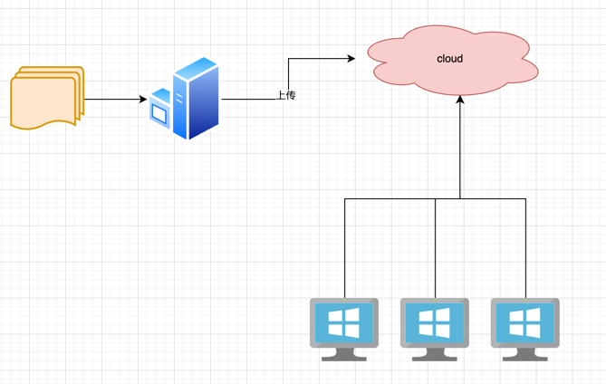

## 项目简介
  pemo是一个帮助用户下载服务器上的文件的命令行工具, 它依托于云存储服务实现中转。


## 安装方式
```python
   pip install pemo
```

## 功能蓝图


## 功能清单
 - [X] 上传文件到云端存储服务中
 - [ ] 支持压缩上传文件夹
 - [ ] 支持配置云存储厂商
 - [X] 支持管理配置

> 目前默认支持腾讯云cos, 空间有限建议自行更改为自己的腾讯云cos
> 后续会支持其他的云存储类型如阿里云、百度云等等

## 使用

### 上传文件
```python
   pmeo upload --path ./readme.md 
```
### 上传文件夹
```python
   pmeo upload --path ./dist
```

### 获取配置信息
```python
   ## 查看所有配置
   pmeo config list -A
   ## 查看指定类型的配置
   pmeo config list -t ali
```
### 配置信息
```python
   ## 配置信息
   pmeo config set -t ali

   ## 配置默认存储类型
   pmeo config set-default -t ali
```


