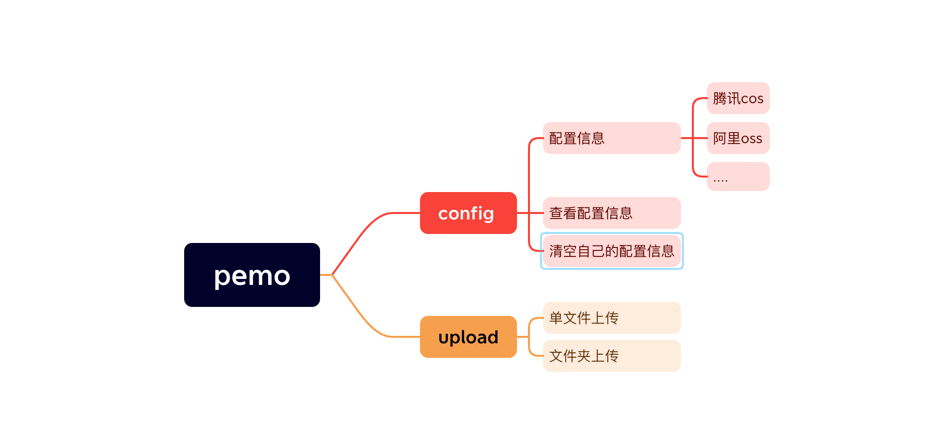

## 项目简介
  pytrans是一个帮助用户下载服务器上的文件的命令行工具, 它依托于云存储服务实现中转。


## 安装方式
```python
   pip install pemo
```

## 功能蓝图


## 功能清单
 - [X] 上传文件到云端存储服务中
 - [ ] 支持压缩上传文件夹
 - [ ] 支持配置云存储厂商

## 使用

### 上传文件
```python
   pmeo upload --path ./readme.md 
```
### 上传文件夹
```python
   pmeo upload --path ./dist
```

### 获取配置信息
```python
   pmeo config list 
```
### 配置信息
```python
   pmeo config list 
```


